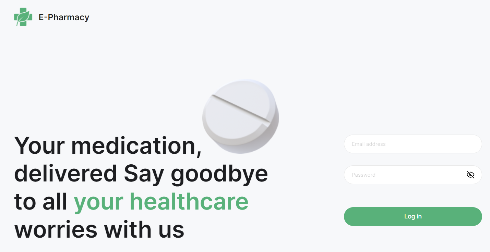
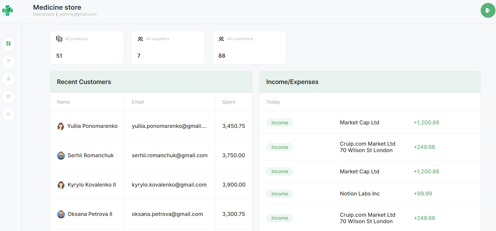
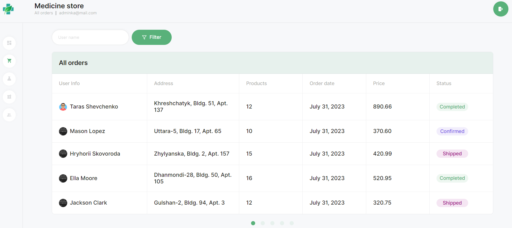
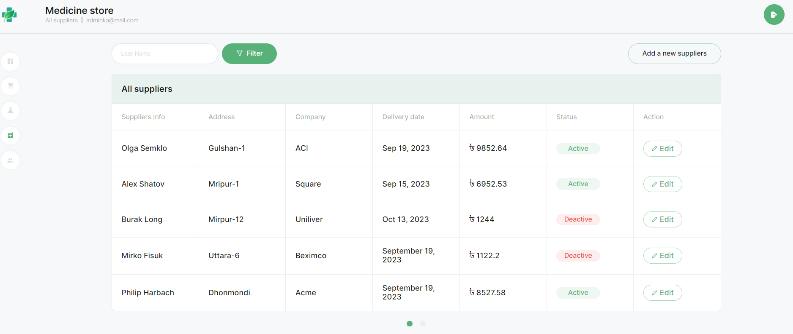
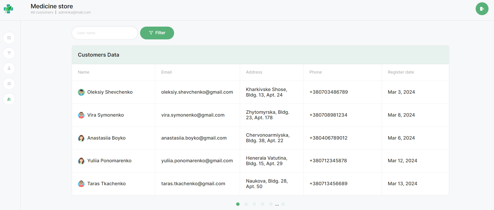

**Read in English: [Admin dashboard Backend](README.md).** 

# Додаток "Admin dashboard"

## Опис

Веб-додаток на React для сторінки Dashboard, яка відображає інформацію про доходи, витрати та інші статистичні дані медичного магазину.

Проект розгорнуто на GitHub Pages та https://render.com/

## Основні технології

- React.js
- React Hook Form і Yup для валідації форм
- React Router для маршрутизації

## Login page

На цій сторінці адмін вводить свій емейл та пароль для входження в Admin dashboard.
Емейл: adminka@mail.com
Пароль: adminka

## Всі наступні сторінки доступні для авторизованого користувача

## Dashboard page

"DasboardPage - складається з компонентів Statistics, Recent Customers, Income/Expenses.

Компонент Statistic відображає інформацію про кількість продуктів, постачальників та замовників.

## All orders page

На цій сторінці для кожного замовлення виведено дані про користувача (User Info), адресу доставки (Address), список товарів (Products), дату замовлення (Order date), ціну (Price), статус (Status).
Реалізований пошук по імені з використанням Інпуту та кнопки Filter.
Реалізовано пагінацію.

## All products page

На цій сторінці для кожного продукту виведено інформацію про продукт (Product Info), його категорію (Category), кількість на складі (Stock), постачальників (Suppliers), ціну (Price), та дії (Action).
По кнопці "+" є можливість додати новий продукт.
Реалізовано можливість редагуання інформації по продукту та видалення продукту.
Реалізований пошук по імені з використанням Інпуту та кнопки Filter.
Реалізовано пагінацію.

## All suppliers page

На цій сторінці відображається список постачальників з наступними стовбцями: Suppliers Info, Address, Company, Delivery date, Ammount, Status та Action (дії редагування).
По кнопці "Add a new suppliers" є можливість додати нового постачальника.
Реалізований пошук по імені з використанням Інпуту та кнопки Filter.
Реалізовано пагінацію.

## All customers page

На цій сторінці відображається список клієнтів з наступними стовбцями: Name (інформація про користувача), Email, Address, Phone, Register date.
Реалізований пошук по імені з використанням Інпуту та кнопки Filter.
Реалізовано пагінацію.

## Демо

Проєкт доступний за посиланням [Admin dashboard](https://katerynabachkalo.github.io/admin-dashboard).

## Технології, які використовувались

**Front-end** 
`TypeScript` `React` `React Router` `ReduxToolkit` `ReduxPersist` `nanoid` `HTML/CSS` `react-loader-spinner` `react-toastify` `react-hook-form` `Yup` `react-table` `react-calendar` `react-icons`

**Back-end** 
`Node.js` `Express` `Mongoose` `Joi` `MongoDB`
