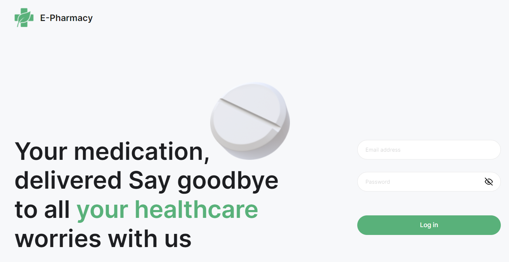
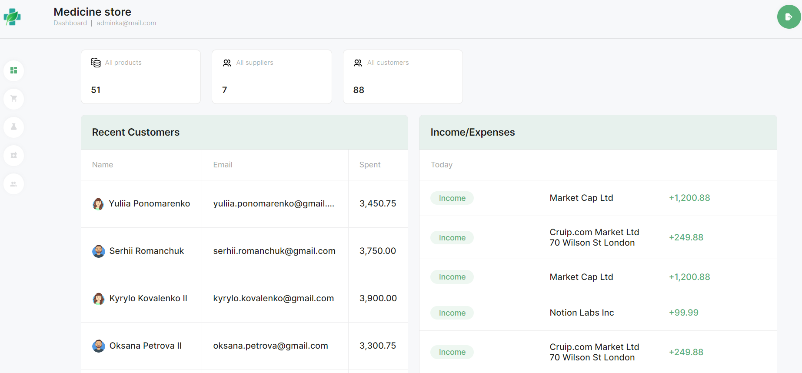
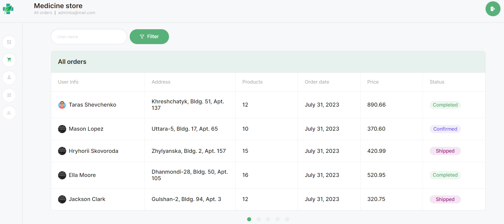
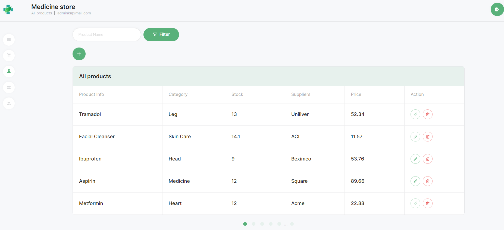
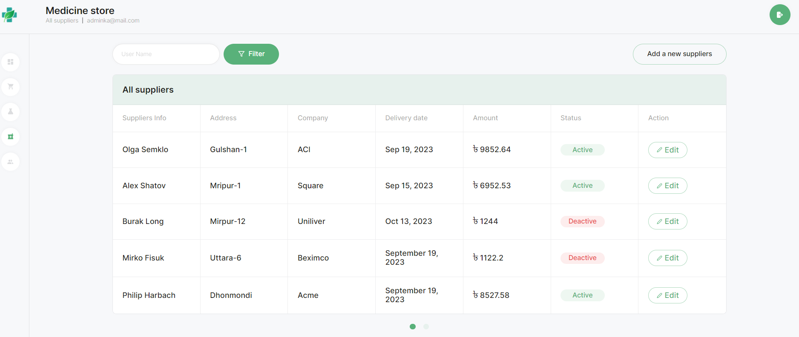
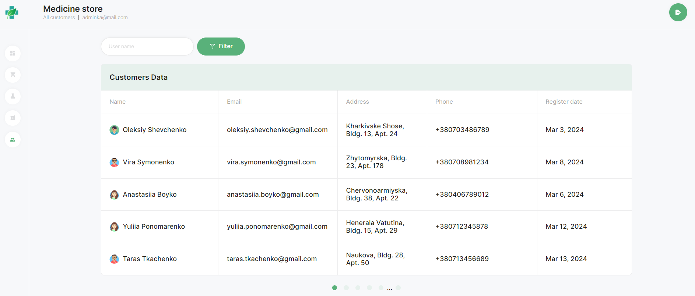

**Читати українською: [Admin dashboard Backend](README_ua.md).** 

# Application "Admin dashboard"

## Description

A web application on React for a Dashboard page that displays information about income, expenses and other statistics of a medical store.

The project is deployed on GitHub Pages and https://render.com/

## Basic technologies

- React.js
- React Hook Form and Yup for form validation
- React Router for routing

## Login page

On this page, the admin enters his email and password to enter the Admin dashboard.
E-mail: adminka@mail.com
Password: adminka

## All the following pages are available for authorized users

## Dashboard page

"DasboardPage - consists of Statistics, Recent Customers, Income/Expenses components.

The Statistic component displays information about the number of products, suppliers and customers.

## All orders page

On this page, data about the user (User Info), delivery address (Address), list of products (Products), order date (Order date), price (Price), status (Status) are displayed for each order.
Implemented search by name using Input and the Filter button.
Implemented pagination.

## All products page

On this page, for each product, information about the product (Product Info), its category (Category), quantity in stock (Stock), suppliers (Suppliers), price (Price), and actions (Action) is displayed.
You can add a new product using the "+" button.
The ability to edit product information and delete a product has been implemented.
Implemented search by name using Input and the Filter button.
Implemented pagination.

## All suppliers page

This page displays a list of suppliers with the following columns: Suppliers Info, Address, Company, Delivery date, Amount, Status and Action (editing actions).
You can add a new supplier using the "Add a new suppliers" button.
Implemented search by name using Input and the Filter button.
Implemented pagination.

## All customers page

This page displays a list of clients with the following columns: Name (user information), Email, Address, Phone, Register date.
Implemented search by name using Input and the Filter button.
Implemented pagination.

## Demo

The project is available at the link [Admin dashboard](https://katerynabachkalo.github.io/admin-dashboard).

## Technologies used in the project

**Front-end** 
`TypeScript` `React` `React Router` `ReduxToolkit` `ReduxPersist` `nanoid` `HTML/CSS` `react-loader-spinner` `react-toastify` `react-hook-form` `Yup` `react-table` `react-calendar` `react-icons`

**Back-end** 
`Node.js` `Express` `Mongoose` `Joi` `MongoDB`
